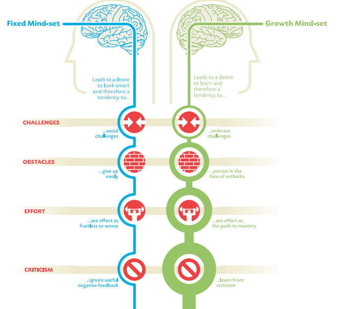

# Here's why your attitude is more important than your intelligence

When: 09 Aug 2017

By: Dr Travis Bradberry
Coauthor of EMOTIONAL INTELLIGENCE 2.0 & President at TalentSmart.

<figure>
    
    <figcaption>Psychologist Carol Dweck has found that your attitude is a better predictor of your success than your IQ. Image: REUTERS/Eddie Keogh</figcaption>
</figure>

When it comes to success, it’s easy to think that people blessed with brains are inevitably going to leave the rest of us in the dust. But new research from Stanford University will change your mind (and your attitude).

Psychologist Carol Dweck has spent her entire career studying attitude and performance, and her latest study shows that your attitude is a better predictor of your success than your IQ.

Dweck found that people’s core attitudes fall into one of two categories: a fixed mindset or a growth mindset.

With a fixed mindset, you believe you are who you are and you cannot change. This creates problems when you’re challenged because anything that appears to be more than you can handle is bound to make you feel hopeless and overwhelmed.

People with a growth mindset believe that they can improve with effort. They outperform those with a fixed mindset, even when they have a lower IQ, because they embrace challenges, treating them as opportunities to learn something new.

<figure>
    
    <figcaption>Image: LinkedIn</figcaption>
</figure>

Common sense would suggest that having ability, like being smart, inspires confidence. It does, but only while the going is easy. The deciding factor in life is how you handle setbacks and challenges. People with a growth mindset welcome setbacks with open arms.

According to Dweck, success in life is all about how you deal with failure. She describes the approach to failure of people with the growth mindset this way,

> “Failure is information—we label it failure, but it’s more like, ‘This didn’t work, and I’m a problem solver, so I’ll try something else.’”

Regardless of which side of the chart you fall on, you can make changes and develop a growth mindset. What follows are some strategies that will fine-tune your mindset and help you make certain it’s as growth oriented as possible.

Don’t stay helpless. We all hit moments when we feel helpless. The test is how we react to that feeling. We can either learn from it and move forward or let it drag us down. There are countless successful people who would have never made it if they had succumbed to feelings of helplessness: Walt Disney was fired from the Kansas City Star because he “lacked imagination and had no good ideas,” Oprah Winfrey was fired from her job as a TV anchor in Baltimore for being “too emotionally invested in her stories,” Henry Ford had two failed car companies prior to succeeding with Ford, and Steven Spielberg was rejected by USC’s Cinematic Arts School multiple times. Imagine what would have happened if any of these people had a fixed mindset. They would have succumbed to the rejection and given up hope. People with a growth mindset don’t feel helpless because they know that in order to be successful, you need to be willing to fail hard and then bounce right back.

Be passionate. Empowered people pursue their passions relentlessly. There’s always going to be someone who’s more naturally talented than you are, but what you lack in talent, you can make up for in passion. Empowered people’s passion is what drives their unrelenting pursuit of excellence. Warren Buffet recommends finding your truest passions using, what he calls, the 5/25 technique: Write down the 25 things that you care about the most. Then, cross out the bottom 20. The remaining 5 are your true passions. Everything else is merely a distraction.

Take action. It’s not that people with a growth mindset are able to overcome their fears because they are braver than the rest of us; it’s just that they know fear and anxiety are paralyzing emotions and that the best way to overcome this paralysis is to take action. People with a growth mindset are empowered, and empowered people know that there’s no such thing as a truly perfect moment to move forward. So why wait for one? Taking action turns all your worry and concern about failure into positive, focused energy.

Then go the extra mile (or two). Empowered people give it their all, even on their worst days. They’re always pushing themselves to go the extra mile. One of Bruce Lee’s pupils ran three miles every day with him. One day, they were about to hit the three-mile mark when Bruce said, “Let’s do two more.” His pupil was tired and said, “I’ll die if I run two more.” Bruce’s response? “Then do it.” His pupil became so angry that he finished the full five miles. Exhausted and furious, he confronted Bruce about his comment, and Bruce explained it this way: “Quit and you might as well be dead. If you always put limits on what you can do, physical or anything else, it’ll spread over into the rest of your life. It’ll spread into your work, into your morality, into your entire being. There are no limits. There are plateaus, but you must not stay there; you must go beyond them. If it kills you, it kills you. A man must constantly exceed his level.”

If you aren’t getting a little bit better each day, then you’re most likely getting a little worse—and what kind of life is that?

Expect results. People with a growth mindset know that they’re going to fail from time to time, but they never let that keep them from expecting results. Expecting results keeps you motivated and feeds the cycle of empowerment. After all, if you don’t think you’re going to succeed, then why bother?

Be flexible. Everyone encounters unanticipated adversity. People with an empowered, growth-oriented mindset embrace adversity as a means for improvement, as opposed to something that holds them back. When an unexpected situation challenges an empowered person, they flex until they get results.

Don't complain when things don't go your way. Complaining is an obvious sign of a fixed mindset. A growth mindset looks for opportunity in everything, so there’s no room for complaints.

Bringing It All Together

By keeping track of how you respond to the little things, you can work every day to keep yourself on the right side of the chart above.

About The Author: 

Dr. Travis Bradberry is the award-winning co-author of the #1 bestselling book, Emotional Intelligence 2.0, and the cofounder of TalentSmart, the world's leading provider of emotional intelligence tests and training, serving more than 75% of Fortune 500 companies. His bestselling books have been translated into 25 languages and are available in more than 150 countries. Dr. Bradberry has written for, or been covered by, Newsweek, BusinessWeek, Fortune, Forbes, Fast Company, Inc., USA Today, The Wall Street Journal, The Washington Post, and The Harvard Business Review.