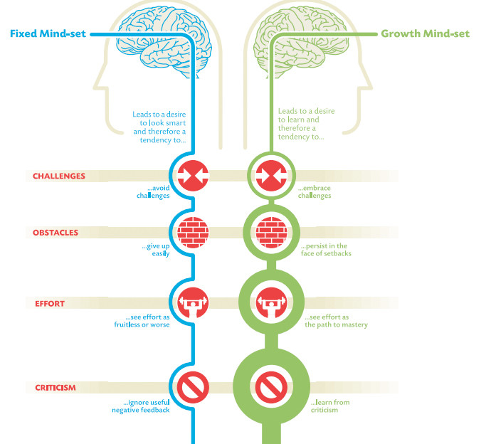

# O porquê de seu comportamento ser mais importante do que sua inteligência

>Tradução livre do artigo "Here's why your attitude is more important than your intelligence", disponível no site https://www.weforum.org/agenda/2017/08/heres-why-your-attitude-is-more-important-than-your-intelligence/, publicado em 09 de agosto de 2017.

<figure>
    
    <figcaption>A psicóloga Carol Dweck descobriu que sua comportamento é indicador mais preciso do seu sucesso do que seu QI. Imagem: REUTERS/Eddie Keogh</figcaption>
</figure>

Quando falamos de sucesso, é fácil pensar que as pessoas que tem um cérebro privilegiado vão inevitalvemente deixar todo o resto de nós para trás. Mas uma nova pesquisa da Universidade de Stanford deve mudar sua opinião (e seu comportamento).

A psicóloga Carol Dweck passou toda sua carreira estudando comportamento e performance, e seu último estudo mostra que o comportamento é um indicador mais preciso do seu sucesso do que seu QI.

Dweck descobriu que os comportamentos principais das pessoas se enquadram eu duas categorias, com base em modelos mentais: um mindset fixo ou um mindset de crescimento.

Com um mindset fixo, você acredita que você é quem é e não pode mudar. Isso cria problemas quando você é desafiado pois qualquer coisa que pareça ser mais do que você consegue lidar te fará sentir-se sem esperança e sobrecarregado.

Pessoas com um mindset de crescimento acreditam que elas podem melhorar com base no esforço. Elas superam aquelas com um mindset fixo mesmo se tiverem um QI menor pois aceitam desafios, tratando-os como oportunidades para aprender algo novo.

<figure>
    
    <figcaption>Image: LinkedIn</figcaption>
</figure>

O senso comum pode sugerir que ter habilidades, como ser inteligente, traz confiança. Sim, isso acontece, mas apenas enquanto as coisas estão fáceis. O fator decisivo na vida é como lidamos com as dificuldades e os desafios. As pessoas com um mindset de crescimento recebem os problemas de braços abertos.

De acordo com Dweck, o sucesso na vida é completamente ligado a como lidamos com o fracasso. Ela descreve essa abordagem sobre o fracasso nas pessoas com mindset de crescimento como

> "O fracasso é informação - nós que o classificamos assim, no entanto seria mais como, 'Isso não funcionou, e eu sou um solucionador de problemas, por isso vou tentar algo diferente.'"

Independentemente de qual lado do gráfico você está, você pode fazer mudanças e desenvolver um mindset de crescimento. A seguir temos algums estratégias que irão ajustar o seu mindset e ajudar você a ter certeza que a orientação ao crescimento é possível.

***Não se sinta impotente***. Todos nós temos alguns momentos que nos sentimos assim. O teste é sobre como reagimos a esse sentimento. Podemos tanto aprender a partir dele e seguir em frente quanto deixá-lo nos destruir. Existem inúmeras pessoas de sucesso que poderiam não ter conseguido nada se tivessem sucumbido aos sentimentos de impotência: Walt Disney foi despedido do jornal Kansas City Star porque "faltava imaginação e não tinha boas ideias", Oprah Winfrey foi despedida de seu trabalho como âncora de TV em Baltimore por estar "se envolvendo demais emocionalmente em suas histórias", Henry Ford faliu duas empresas de carro antes de ter sucesso com a Ford e Steven Spielbert foi rejeitado muitas vezes na Escola de Artes Cênicas da USC. Imagine o que poderia ter acontecido se uma dessas pessoas tivesse um mindset fixo. Elas teriam sucumbido com a rejeição e perdido a esperança. Pessoas com um mindset de crescimento não se sentem impotentes pois sabem que, para ter sucesso, você precisa estar disposto a falhar e depois reagir.

***Seja apaixonado***. Pessoas poderosas perseguem suas paixões incansavelmente. Sempre haverá alguém naturalmente mais talentoso que você, mas o que te falta em talento você compensa com paixão. A paixão das pessoas poderoas é o que as leva à busca incessante da excelência. Warren Buffet recomenda que se encontre suas paixões verdadeiras usando, como ele chama, a técnica 5/25: escreva num papel as 25 coisas com as quais você mais se importa. Depois, risque as 20 menos importanets. As 5 que sobrarem são suas verdadeiras paixões. Todo o resto é meramente uma distração.

***Tome uma atitude***. Não é que as pessoas com um mindset de crescimento conseguem superar seus medos porque são mais corajosas do que o resto de nós; elas apenas sabem que o medo e a ansiedade são emoções paralisantes e tomam uma atitude. As pessoas com um mindset de crescimento são poderosas, e pessoas poderosas sabem que não existe um momento ideal para seguir em frente. Então por que ficar esperando? Tomar uma atitude torna todas as suas preocupações e inquietações sobre o fracasso em energia positiva e focada.

***Faça um esforço adicional (ou dois)***. Pessoas poderosas dão o seu melhor, mesmo nos seus piores dias. Elas sempre se forçam a fazer um esforço adicional. Um dos alunos de Bruce Lee corria três milhas com ele todos os dias. Um dia, eles estavam próximos de chegar na marca das três milhas e Bruce falou, "Vamos mais duas". O aluno estava cansado e disse, "Eu morro se correr mais duas". A resposta de Bruce? "Então faça isso.". Seu aluno ficou tão irritado que terminou completamente as cinco milhas. Exausto e furioso, ele confrontou Bruce sobre seu comentário, e Bruce explicou dessa forma: "Desista e você também pode morrer. Se você sempre limitar o que pode fazer, fisicamente ou de qualquer outra forma, isso se propagará pelo resto da sua vida. No seu trabalho, na sua moral, em todo o seu ser. Não existem limites. Existem platôs, mas você não pode ficar ali; você precisa superá-los. Se isso te matar, está feito. Um homem precisa superar constantemente o seu nível."

Se você não estiver um pouco melhor a cada dia, então você provalvelmente está um pouco pior - e que tipo de vida é essa?

***Espere os resultados*** Pessoas com um mindset de crescimento sabem que vão fracassar de tempos em tempos, mas elas nunca deixam isso tirar suas expectivas de resultados. Esperar os resultados mantém você motivado e alimenta o ciclo do poder. Afinal, se você não pensar que vai ter sucesso, para que se preocupar?

***Seja flexível*** Todos nós encontramos adversidades imprevistas. As pessoas com um mindset poderoso e orientado ao crescimento aceitam as adversidades como uma forma de melhoria e não como algo que as atrasa. Quando uma situação inesperada desafia uma pessoa poderosa, ela se adapta até que chegue nos resultados.

***Não reclame quando as coisas não saem do seu jeito***. Reclamar é um óbvio sinal de um mindset fixo. Um mindset de crescimento olha por oportunidades em tudo, por isso não existe espaço para reclamações.

## Juntando tudo

Acompanhando como você responde a essas pequenas coisas, você pode trabalhar a cada dia para se manter no lado direito do gráfico acima.

## Sobre o autor

Dr. Travis Bradberry is the award-winning co-author of the #1 bestselling book, Emotional Intelligence 2.0, and the cofounder of TalentSmart, the world's leading provider of emotional intelligence tests and training, serving more than 75% of Fortune 500 companies. His bestselling books have been translated into 25 languages and are available in more than 150 countries. Dr. Bradberry has written for, or been covered by, Newsweek, BusinessWeek, Fortune, Forbes, Fast Company, Inc., USA Today, The Wall Street Journal, The Washington Post, and The Harvard Business Review.
